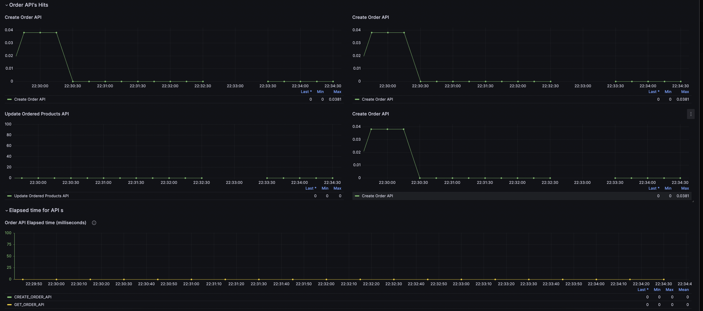
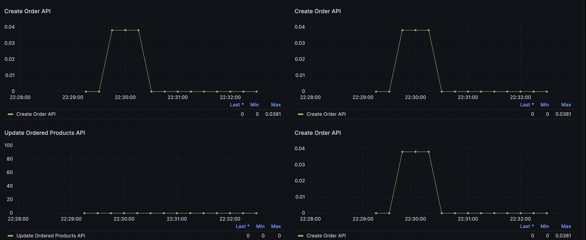

# Order Service

Order service is services which has a APIs to create , update, update order status of an order. 

## Features 
- Create Order: Lets the user to create a order with help of product and customer details 
- Update Order Status: Lets the user to update the status of the order 
- Update Order product : Lets the user to update the product id 
- Observality : Added api hit metric, elapsed time of APIs metric 

## Observality 
- Grafana Screenshot

- APIs Hit metrics Screenshots

### Reference : 
- https://gabrieltanner.org/blog/collecting-prometheus-metrics-in-golang/
- https://promlabs.com/promql-cheat-sheet/

##  API s 
### Create Order 
http://localhost:8080/v1/order/create 
`{
    "customer_id": 1,
    "products": [
        {
            "id": 1
        },
        {
            "id": 2
        }
    ]
}`

 Response 
{
    "OrderID": 3,
    "message": "Order Created Successfully!",
    "status": 201
} 

### Get Order by ID 
http://localhost:8080/v1/order/7 

 Response 
`{
    "message": "Order Details Fetched Successfully!",
    "order": [
        {
            "ID": 1,
            "OrderID": 1,
            "ProductID": 1,
            "CustomerID": 1,
            "CreatedAt": "2023-07-02T19:57:49.276005+05:30",
            "UpdatedAt": "2023-07-02T19:57:49.276005+05:30"
        },
        {
            "ID": 2,
            "OrderID": 1,
            "ProductID": 2,
            "CustomerID": 1,
            "CreatedAt": "2023-07-02T19:57:49.278145+05:30",
            "UpdatedAt": "2023-07-02T19:57:49.278146+05:30"
        }
    ],
    "status": 200
}`

### Update Status of an order
http://localhost:8080/v1/order/1 
`{
    "status":"DELIEVERED"
}`

 Response 
`{
    "message": "Order Updated Successfully!",
    "status": 200
}`

### Update Order Products API 
http://localhost:8080/v1/order/updateOrderProducts/7 
`{
    "customer_id": 1,
    "products": [
        {
            "id": 3
        },
        {
            "id": 4
        }
    ]
}`

 Response 
`{
    "message": "Order Updated Successfully!",
    "status": 200
}`

## TODO 
- [ ] Update Order products API : User should be allowed to update product details once order status is in SHIPPED status  
- [ ] Add delete api 
- [ ] Add any update to created order status in kafka topic 
- [x] Use Grafana dashboard to visualize all the prometheus metrics 
    - For uptime metric : uptime > 0
    - For Api counter metric : rate(<api_name>[$__rate_interval])
    - For elapse time metric : order_service_apis_elapsed_time with label as apiname 
- [ ] Add a docker compose file 

## Database commands 
# Database commands 
To start postgresql 
 `psql -h localhost -p <port-number> -U shriyavimalsundriyal`

To list databases 
 `\l`

To connect to new database
 `\c <database name>`

To list of tables in database 
 `\d` 

To list the property / attribute of table 
 `\d <table-name>`